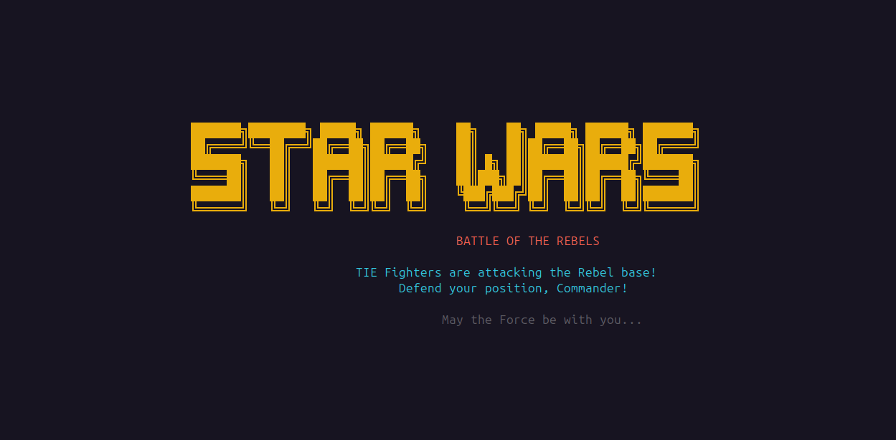
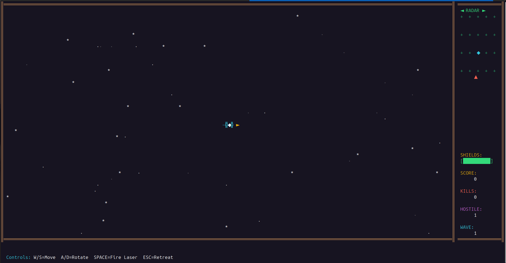

                             
```
███████╗████████╗ █████╗ ██████╗ ██╗    ██╗ █████╗ ██████╗ ███████╗    
██╔════╝╚══██╔══╝██╔══██╗██╔══██╗██║    ██║██╔══██╗██╔══██╗██╔════╝    
███████╗   ██║   ███████║██████╔╝██║ █╗ ██║███████║██████╔╝███████╗    
╚════██║   ██║   ██╔══██║██╔══██╗██║███╗██║██╔══██║██╔══██╗╚════██║    
███████║   ██║   ██║  ██║██║  ██║╚███╔███╔╝██║  ██║██║  ██║███████║    
╚══════╝   ╚═╝   ╚═╝  ╚═╝╚═╝  ╚═╝ ╚══╝╚══╝ ╚═╝  ╚═╝╚═╝  ╚═╝╚══════╝    
                                                                       
                                                                       
               ██████╗  █████╗ ███╗   ███╗███████╗                     
              ██╔════╝ ██╔══██╗████╗ ████║██╔════╝                     
              ██║  ███╗███████║██╔████╔██║█████╗                       
              ██║   ██║██╔══██║██║╚██╔╝██║██╔══╝                       
              ╚██████╔╝██║  ██║██║ ╚═╝ ██║███████╗                     
               ╚═════╝ ╚═╝  ╚═╝╚═╝     ╚═╝╚══════╝                     
```




                   
### Linux / macOS
```bash
    curl -s https://raw.githubusercontent.com/AkshayDhola/starwars/master/scripts/install.sh | bash
```

### Run the Game
```bash
    starwars
```
## *May The Force Be With You!* ✨
